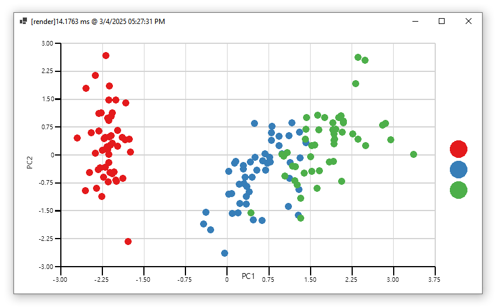

# ``Plot#``

A interactive data visualization canvas for ggplot on clr environment.



```vbnet
Dim iris = DataFrame.read_csv("./bezdekIris.csv")
Dim classes As StringVector = iris!class
Call iris.delete("class")
Dim pca = iris.CommonDataSet().PrincipalComponentAnalysis(maxPC:=2).GetPCAScore
Dim plot As ggplot.ggplot = ggplotFunction.ggplot(pca.add("class", classes), mapping:=aes("PC1", "PC2", color:="class"), colorSet:="jet", padding:="padding: 5% 10% 10% 10%;")

plot += geom_point(size:=12)

view.ScaleFactor = 1
view.PlotPadding = plot.ggplotTheme.padding
view.ggplot = plot
```